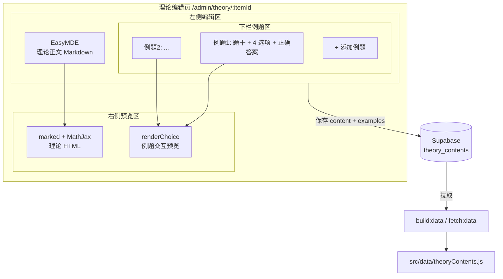
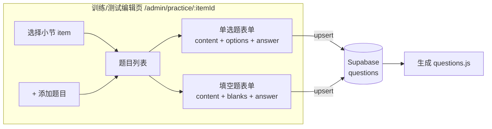

> 文档状态：目标设计，部分实现；后台当前已有真实编辑能力，但接口边界和视觉细节仍需与代码复核。
>
> 当前事实以 `src/views/admin/adminPage.js`、`src/services/admin.js` 和技术架构文档为准。

# CourseCore 后台内容编辑器设计

> 本方案重点描述课程「理论 / 训练 / 测试」三类内容的编写逻辑，以及可以复用的开源模块。
> UI 细节（颜色、间距、动画）暂不讨论，后续单独出稿。

---

## 1. 设计目标

让管理员在后台能够：

1. 新增或修改「理论」小节：Markdown 正文 + 若干道理论例题。
2. 新增或修改「训练」小节：若干道单选题 / 填空题。
3. 新增或修改「测试」小节：若干道单选题 / 填空题（结构与训练一致，业务入口不同）。

所有内容最终写入 Supabase，构建时通过 `fetch:data` 生成 `src/data/*.js`。

---

## 2. 与现有项目的对应关系

| 新概念 | 落点 | 说明 |
|---|---|---|
| 理论 | `items.type = 'theory'` + `theory_contents` 表 | 已在 [adminPage.js](file:///c:/Users/vitoriga/OneDrive/Desktop/CourseCore/src/views/admin/adminPage.js) 和 [admin.js](file:///c:/Users/vitoriga/OneDrive/Desktop/CourseCore/src/services/admin.js) 有读写逻辑 |
| 训练 | `items.type = 'training'` + `questions` 表 | 复用 `questions` 表，题型限定为单选 / 填空 |
| 测试 | `items.type = 'quiz'` 或新增 `'test'` + `questions` 表 | 同训练，仅前端入口和计分规则不同 |
| 题型枚举 | [src/config/question-types.js](file:///c:/Users/vitoriga/OneDrive/Desktop/CourseCore/src/config/question-types.js) | 单选题 `0`，填空题 `2`，无需新增枚举 |
| 题目渲染 | [src/views/question/choice.js](file:///c:/Users/vitoriga/OneDrive/Desktop/CourseCore/src/views/question/choice.js) / [fill.js](file:///c:/Users/vitoriga/OneDrive/Desktop/CourseCore/src/views/question/fill.js) | 后台预览直接复用 |
| Markdown 渲染 | `marked` + `MathJax` | `marked` 已在依赖，MathJax 已在 [main.js](file:///c:/Users/vitoriga/OneDrive/Desktop/CourseCore/src/main.js#L167) 调用 |

---

## 3. 可复用开源模块

| 模块 | 仓库 | 用途 | 是否必须 |
|---|---|---|---|
| **EasyMDE** | [Ionaru/easy-markdown-editor](https://github.com/Ionaru/easy-markdown-editor) | Markdown 双栏编辑器（左侧编辑，右侧预览） | 推荐 |
| **marked** | 已安装 `marked@18` | Markdown → HTML | 必须（已存在） |
| **MathJax** | 已集成 `tex-mml-chtml` | 公式渲染 | 必须（已存在） |
| **Split.js** | [nathancahill/Split.js](https://github.com/nathancahill/Split.js) | 左右 / 上下分栏拖拽 | 可选，CSS Grid 也可替代 |
| **SortableJS** | [SortableJS/Sortable](https://github.com/SortableJS/Sortable) | 例题 / 题目顺序拖拽 | 可选 |
| **freeCodeCamp `add-quizzes.js`** | [freeCodeCamp/freeCodeCamp](https://github.com/freeCodeCamp/freeCodeCamp/blob/main/tools/challenge-parser/parser/plugins/add-quizzes.js) | Markdown 题目区块解析思路，可用于导入/导出 | 仅参考 |

> 说明：项目当前是**原生 ES Modules + Tailwind**，不引入 React。因此不选 Milkdown / Toast UI Editor 等依赖 React/Vue 的方案，优先 EasyMDE。

---

## 4. 理论编辑器设计

### 4.1 页面结构

```
┌──────────────────────────────┬──────────────────────────────┐
│ 左侧编辑区                    │ 右侧预览区                    │
│                              │                              │
│  ┌────────────────────────┐  │  ┌────────────────────────┐  │
│  │ 理论正文 Markdown      │  │  │ 理论正文 HTML           │  │
│  │ (EasyMDE)              │  │  │ (marked + MathJax)      │  │
│  └────────────────────────┘  │  └────────────────────────┘  │
│  ┌────────────────────────┐  │  ┌────────────────────────┐  │
│  │ 理论例题区              │  │  │ 例题交互预览             │  │
│  │ - 题干 Markdown        │  │  │ (renderChoice)          │  │
│  │ - 4 个选项             │  │  │                          │  │
│  │ - 正确答案              │  │  │                          │  │
│  │ [+ 添加例题]            │  │  │                          │  │
│  └────────────────────────┘  │  └────────────────────────┘  │
└──────────────────────────────┴──────────────────────────────┘
```

### 4.2 数据模型

理论例题直接内嵌在 `theory_contents.examples` 字段中，不进入 `questions` 表。

```jsonc
{
  "item_id": "p1b-m1-01",
  "course_id": "physics-b-1",
  "module_id": "p1b-m1",
  "content": "### 位置矢量...",
  "examples": [
    {
      "text": "质点沿 $x$ 轴运动，其加速度为...",
      "options": [
        "$x = t^2$",
        "$x = t^3$",
        "$x = 2t$",
        "$x = t$"
      ],
      "answer": 1,
      "solution": "对加速度积分两次..."
    }
  ]
}
```

字段说明：

- `content`：理论正文，Markdown。
- `examples`：例题数组。
- `examples[i].text`：题干，Markdown。
- `examples[i].options`：四个选项，纯文本或 Markdown。
- `examples[i].answer`：正确选项索引（0–3）。
- `examples[i].solution`：解析，可选，Markdown。

### 4.3 与现有代码的衔接

- 读取：[admin.js::getTheoryContent(itemId)](file:///c:/Users/vitoriga/OneDrive/Desktop/CourseCore/src/services/admin.js#L215)
- 保存：[admin.js::upsertTheoryContent(record)](file:///c:/Users/vitoriga/OneDrive/Desktop/CourseCore/src/services/admin.js#L238)
- 构建产物：[src/data/theoryContents.js](file:///c:/Users/vitoriga/OneDrive/Desktop/CourseCore/src/data/theoryContents.js) 会自动包含 `examples` 字段。

---

## 5. 训练 / 测试编辑器设计

### 5.1 页面结构

```
┌─────────────────────────────────────────┐
│ 选择小节（training / test）              │
├─────────────────────────────────────────┤
│ 题目列表                                  │
│  ┌─────────────────────────────────┐   │
│  │ 单选题表单                       │   │
│  │ - 题干 Markdown                  │   │
│  │ - 4 个选项                       │   │
│  │ - 正确答案                       │   │
│  │ - 解析 Markdown                  │   │
│  └─────────────────────────────────┘   │
│  ┌─────────────────────────────────┐   │
│  │ 填空题表单                       │   │
│  │ - 题干 Markdown                  │   │
│  │ - 空数                           │   │
│  │ - 标准答案（字符串或数组）        │   │
│  │ - 解析 Markdown                  │   │
│  └─────────────────────────────────┘   │
│  [+ 添加题目]                             │
└─────────────────────────────────────────┘
```

### 5.2 数据模型

训练题和测试题共用 `questions` 表，通过 `item_id` 关联。

```jsonc
// 单选题
{
  "id": "q-physics-b-1-p1b-m1-training-001",
  "item_id": "p1b-m1-01",
  "course_id": "physics-b-1",
  "module_id": "p1b-m1",
  "question_type": 0,
  "title": "加速度积分",
  "content": "质点沿 $x$ 轴运动，其加速度为...",
  "options": ["$x=t^2$", "$x=t^3$", "$x=2t$", "$x=t$"],
  "answer": "1",
  "solution": "对加速度积分两次...",
  "difficulty": 2,
  "tags": ["运动学"],
  "source": "力学练习一"
}

// 填空题
{
  "id": "q-physics-b-1-p1b-m1-training-010",
  "item_id": "p1b-m1-01",
  "course_id": "physics-b-1",
  "module_id": "p1b-m1",
  "question_type": 2,
  "title": "速度计算",
  "content": "已知 $a = 3 + 2t$，初速度 $v_0 = 5$，则 $t=3$ 时速度为 ______。",
  "blanks": 1,
  "answer": "23",
  "solution": "积分...",
  "difficulty": 2
}
```

### 5.3 与现有代码的衔接

- 题型枚举：[src/config/question-types.js](file:///c:/Users/vitoriga/OneDrive/Desktop/CourseCore/src/config/question-types.js)
- 保存接口：[admin.js::createQuestion / updateQuestion / deleteQuestion](file:///c:/Users/vitoriga/OneDrive/Desktop/CourseCore/src/services/admin.js#L174)
- 题目预览：[src/views/question/choice.js](file:///c:/Users/vitoriga/OneDrive/Desktop/CourseCore/src/views/question/choice.js)、[fill.js](file:///c:/Users/vitoriga/OneDrive/Desktop/CourseCore/src/views/question/fill.js)

---

## 6. 数据流图

### 6.1 理论编辑流



### 6.2 训练 / 测试编辑流



---

## 7. 关键实现决策

1. **理论例题不进入 `questions` 表**
   - 理由：理论例题结构固定（单选、4 选项、只在当前理论页展示），不需要参与训练/测试的随机抽题和进度统计。JSON 内嵌最轻量。

2. **训练 / 测试共用 `questions` 表**
   - 理由：两者字段完全一致（题干、选项/答案、解析），区别仅在前端入口和计分规则，无需拆表。

3. **Markdown 编辑器选 EasyMDE**
   - 理由：原生 JS 可用，无需 React 运行时，与现有技术栈一致。

4. **预览复用现有渲染器**
   - 理由：避免后台和前端题目样式不一致，也减少重复代码。

5. **题目导入/导出可借鉴 freeCodeCamp**
   - 未来如果要做「批量导入 Markdown 题目」，可以参考 freeCodeCamp 的 `--question--` / `--distractors--` / `--answer--` 区块设计。

---

## 8. 建议的 MVP 实现顺序

1. **先做理论编辑器**
   - 新建 `/admin/theory/:itemId` 页面。
   - 集成 EasyMDE + marked + MathJax。
   - 实现「添加例题」动态表单。
   - 保存到 `theory_contents`。

2. **再做训练 / 测试编辑器**
   - 在 [adminPage.js](file:///c:/Users/vitoriga/OneDrive/Desktop/CourseCore/src/views/admin/adminPage.js) 的题目 Tab 基础上，增加按 `item_id` 筛选。
   - 根据 `question_type` 动态显示选项或填空字段。
   - 新增题目时自动带上当前 `course_id` / `module_id` / `item_id`。

3. **最后做导入/导出**
   - 在题目列表页增加「导入 Markdown」按钮，复用 freeCodeCamp 的题目区块解析思路。

---

## 9. 需要后续确认的问题

- 理论例题是否允许图片？如果允许，需要设计图片上传路径。
- 训练/测试是否支持多选题？当前项目枚举里有 `multipleChoice: 1`，但你的需求里只提到单选和填空。
- 测试是否需要「限时」「随机抽题」「成绩记录」等额外字段？如果需要，再扩展 `items` 或新增 `tests` 表。

---

## 10. 参考链接

- EasyMDE: <https://github.com/Ionaru/easy-markdown-editor>
- Split.js: <https://github.com/nathancahill/Split.js>
- freeCodeCamp 题库解析插件: <https://github.com/freeCodeCamp/freeCodeCamp/blob/main/tools/challenge-parser/parser/plugins/add-quizzes.js>
- 现有后台页面: [src/views/admin/adminPage.js](file:///c:/Users/vitoriga/OneDrive/Desktop/CourseCore/src/views/admin/adminPage.js)
- 现有后台 API: [src/services/admin.js](file:///c:/Users/vitoriga/OneDrive/Desktop/CourseCore/src/services/admin.js)

---

**最后更新时间**: 2026-07-30
# CourseCore 后台内容编辑器设计
# CourseCore 后台内容编辑器设计
# CourseCore 后台内容编辑器设计
