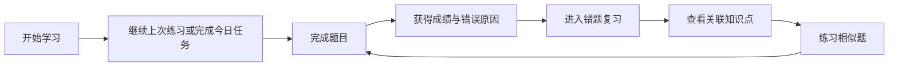
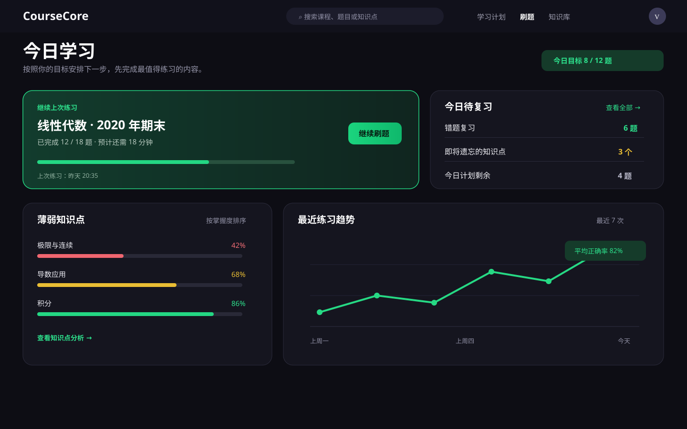
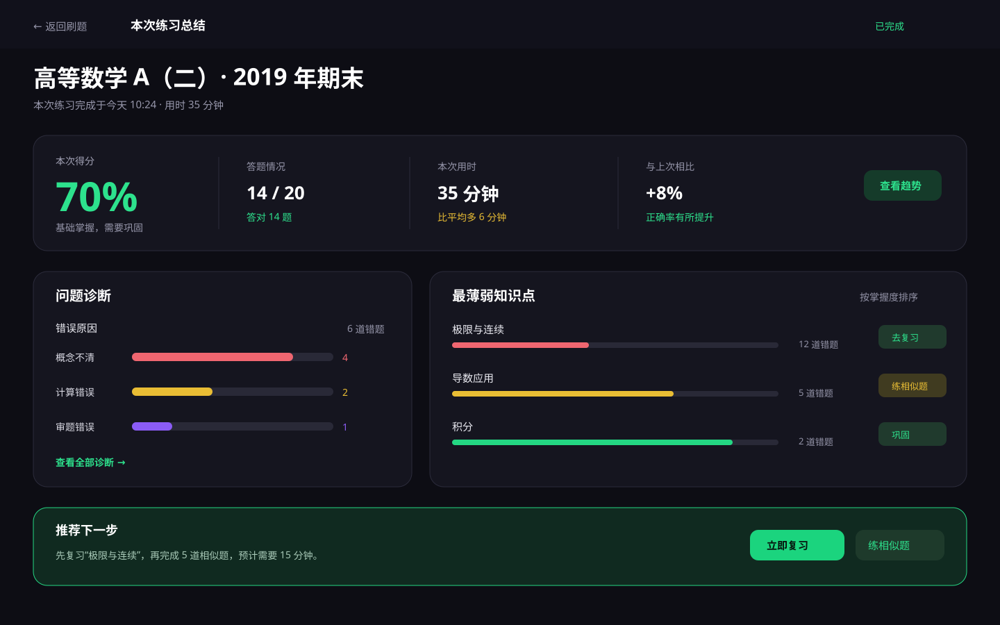
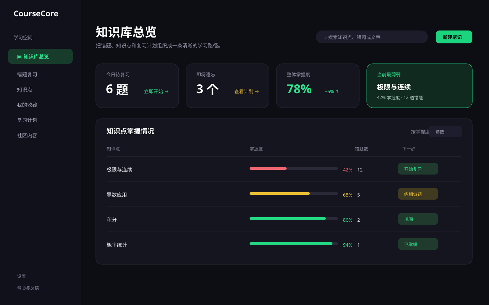
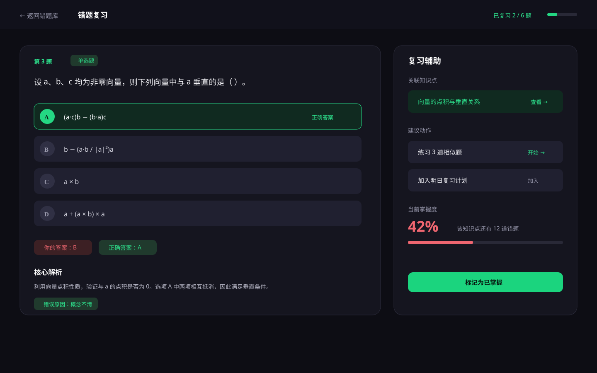

# CourseCore 刷题与知识库完整设计理念

> 版本：V1.0  
> 日期：2026 年 8 月 4 日  
> 适用范围：刷题首页、试卷流程、成绩总结、错题库、知识库、社区内容

## 一、核心命题

不把 CourseCore 做成“题目展示工具”，而是做成一个能帮助用户持续提高的学习系统。

用户打开页面时，最关心的不是系统拥有多少功能，而是：

- 我现在的学习状态是什么？
- 哪些内容最值得优先处理？
- 我下一步应该做什么？

因此，所有页面都遵循同一个基本结构：

> 状态 → 诊断 → 行动

先告诉用户当前状态，再解释问题来源，最后给出明确行动。

## 二、设计总纲

当前产品已经具备刷题、试卷、错题、收藏、知识库和社区等功能。下一阶段的重点不是继续堆叠更多入口，而是把这些入口组织成用户能理解、能完成、能复习的学习路径。



完整闭环是：

> 做题 → 发现错误 → 定位知识点 → 查看解析 → 练习相似题 → 再次验证掌握度

## 三、用户模型：同一个人，在不同阶段有不同任务

| 学习阶段 | 用户真正的问题 | 界面应该提供 |
| --- | --- | --- |
| 开始前 | 我今天应该做什么？ | 继续上次练习、今日目标、预计时长 |
| 刷题中 | 这道题怎么判断？能否快速继续？ | 清晰题干、即时反馈、标记、跳过、解析 |
| 完成后 | 我为什么错？哪里最需要补？ | 成绩诊断、错误原因、薄弱知识点 |
| 复习时 | 怎样避免再次出错？ | 知识点、相似题、复习间隔、掌握度 |

这也是为什么刷题首页应该优先展示“继续上次练习”，而不是把“添加试卷”放在最大的视觉位置。

## 四、五条核心设计理念

### 1. 以用户任务为中心，而不是以功能为中心

产品导航可以按模块组织，但首屏内容应该按任务组织。

用户需要的是：

- 继续学习
- 完成今日复习
- 解决最薄弱的知识点

而不是先理解系统拥有多少模块。

因此：

- 刷题首页优先展示继续练习和今日任务。
- 排行榜、添加试卷等功能降为次级入口。
- 每个页面最多保留一个主要行动按钮。
- 用户在每个页面都应该能看到明确的下一步。

### 2. 让数据最终转化为行动

“正确率 70%”只是结果，不是结论。

更有价值的表达应该是：

> 正确率 70%，其中“极限与连续”掌握度 42%，建议复习 6 道错题，再练习 5 道相似题。

总结页应当形成：

```text
成绩 → 问题诊断 → 薄弱知识点 → 推荐动作
```

所以每一个重要数据旁边，都应该尽量提供对应动作，例如：

- 查看知识点
- 立即复习
- 练习相似题
- 加入复习计划

### 3. 建立刷题、错题和知识库的闭环

错题不是终点，知识库也不是内容仓库。

| 触发场景 | 系统动作 | 用户收益 |
| --- | --- | --- |
| 答题错误 | 记录错误原因和关联知识点 | 知道问题属于哪里 |
| 打开错题 | 提供知识点、解析和相似题 | 知道为什么错、怎么练 |
| 完成复习 | 更新掌握度和下次复习时间 | 知道是否真正掌握 |

每一道错题都应该能够跳转到知识点；每一个知识点也应该能够反向看到关联错题和相似题。

### 4. 用可比较的信息替代装饰性信息

雷达图可以表达整体形状，但不容易回答：

- 哪个知识点最低？
- 哪个知识点退步了？
- 哪个知识点错题最多？
- 今天应该先复习哪一个？

因此，知识分析应优先使用：

- 掌握度进度条
- 错题数量
- 最近复习时间
- 掌握度趋势
- 对应行动按钮

雷达图可以保留作为辅助视觉，但不应该成为唯一分析方式。

### 5. 用设计系统减少随意感

当前产品已经有深色背景和绿色操作色的视觉基础，不需要彻底推翻，而应通过设计系统让页面统一起来。

建议统一：

- 页面栅格
- 间距体系
- 卡片层级
- 按钮优先级
- 状态颜色
- 标签样式
- 题目卡结构
- 空状态和错误状态

## 五、信息架构理念

建议保留模块边界，但在任务层面打通它们。

| 模块 | 核心任务 | 关键入口 |
| --- | --- | --- |
| 今日学习 | 知道今天该做什么 | 继续上次练习、今日目标、待复习 |
| 刷题 | 完成题目并获得反馈 | 按试卷、按题型、按知识点 |
| 总结 | 理解成绩和问题 | 成绩、错误原因、薄弱点、下一步 |
| 知识库 | 补足概念并建立记忆 | 知识点、错题、收藏、复习计划 |
| 社区 | 获取他人的方法和经验 | 文章、讨论、收藏到知识库 |

导航是模块化的，首页却应该是任务化的。

## 六、页面设计理念

### 6.1 刷题首页：先解决“现在做什么”

刷题首页不应该首先展示排行榜和添加试卷，而应该先展示个人学习任务。

推荐信息顺序：

1. 继续上次练习
2. 今日待复习
3. 薄弱知识点
4. 最近练习趋势
5. 我的试卷与按题型练习
6. 社区排行榜等次要内容

主卡片应包含：

- 试卷名称
- 当前进度
- 最近一次练习时间
- 预计剩余时间
- 当前薄弱章节
- “继续刷题”按钮



### 6.2 刷题总结页：从“报告成绩”到“指导下一次”

总结页建议采用四层结构：

| 层级 | 展示内容 | 设计目的 |
| --- | --- | --- |
| 表现 | 得分、答题情况、用时、较上次变化 | 建立结果认知 |
| 诊断 | 知识点、错误原因、题型、用时异常 | 解释结果来源 |
| 错题 | 题号、章节、错误原因、复习状态 | 定位具体问题 |
| 行动 | 立即复习、查看知识点、练相似题 | 推动下一步学习 |

成绩状态也要动态表达：

- 70%：基础掌握，需要巩固
- 82%：掌握良好
- 95%：熟练掌握

避免出现“当前 70%，但标签显示良好 ≥75%”这类状态矛盾。



### 6.3 知识库：从“内容存放”到“复习控制台”

知识库首页要让用户快速知道：

- 哪些内容等待处理？
- 哪些知识点正在遗忘？
- 哪部分掌握度最低？
- 今天最值得复习什么？

首屏建议展示：

- 今日待复习题数
- 即将遗忘的知识点
- 当前最薄弱的三个章节
- 最近掌握度变化
- 统一搜索知识点、错题和文章

知识点列表使用可排序进度表，比单独使用雷达图更适合复习决策。



### 6.4 错题复习：回答“为什么错”

每道错题应该固定包含：

- 题目与选项
- 用户答案
- 正确答案
- 错误原因
- 核心解析
- 关联知识点
- 相似题入口
- 标记为已掌握

错误原因建议统一为：

- 概念不清
- 计算错误
- 审题错误
- 方法不熟
- 时间不足

选项应该使用整行点击区域，并明确区分“你的答案”和“正确答案”。



## 七、视觉语言与情绪设计

深色主题适合长时间学习，但必须避免低对比度和过度沉重。

绿色的作用不是装饰，而是告诉用户：

- 这里可以继续
- 这里已经掌握
- 这里是下一步

| 视觉元素 | 心理作用 | 使用边界 |
| --- | --- | --- |
| 深色背景 | 降低视觉噪音，突出内容 | 保证次要文字对比度 |
| 绿色主色 | 传达进展、成功和可继续 | 不要把所有按钮都染成绿色 |
| 紫色辅助色 | 区分筛选、题型和辅助状态 | 不与成功状态混用 |
| 红色错误色 | 提醒需要处理的问题 | 同时配合文字或图标 |
| 适度圆角 | 降低工具感，提升亲和力 | 统一圆角等级 |

情绪目标是：即使用户成绩不理想，也应该觉得问题是清楚的、可拆解的、下一步可执行的。

## 八、布局和设计系统

### 8.1 页面布局

- 桌面端使用 12 栏栅格。
- 内容最大宽度控制在 1200–1360px。
- 左侧导航固定约 224–240px。
- 页面常用间距使用 16 / 24 / 32px。
- 页面标题、筛选器、内容卡片和底部行动区保持稳定节奏。
- 避免大面积空白和底部孤立按钮。

### 8.2 卡片结构

统一采用：

```text
卡片标题
核心数据或内容
辅助说明
主要操作
```

不要让每一条信息都单独变成卡片，否则会产生碎片化和随意感。

### 8.3 状态表达

状态不能只依靠颜色表达，应该同时使用：

- 文字
- 图标
- 标签
- 进度
- 操作按钮

例如“待复习”不能只显示红色，还要显示“待复习 6 题”和“开始复习”按钮。

### 8.4 数学内容

数学产品的可信度很大程度来自公式排版。所有页面必须统一处理：

- 行内公式
- 独立公式
- 公式换行
- 公式与中文混排
- 公式在选项中的对齐

不能直接把 `$...$` 原始语法展示给用户。

## 九、功能取舍理念

功能丰富不等于入口越多越好。功能应该出现在用户需要它的时刻。

| 优先级 | 能力 | 原因 |
| --- | --- | --- |
| P0 | 公式渲染、首页主任务、总结行动区、错题答案结构 | 直接影响学习效率和可信度 |
| P1 | 错题—知识点双向关联、相似题、遗忘风险、复习计划 | 建立学习闭环 |
| P2 | AI 解析、专项练习、社区收藏、成就体系 | 增强差异化和长期留存 |

排行榜和游戏化功能可以保留，但应该作为辅助激励，不应取代用户自己的目标和进步。

## 十、用户中心原则

### 学习开始前

- 提供继续上次学习、今日目标和预计时长。
- 默认推荐当前最值得做的内容，同时允许用户自定义。

### 学习进行中

- 自动保存题目进度，允许跳过和返回。
- 解析、知识点和标记操作尽量不离开当前页面。
- 使用文字、图标和状态标签共同表达结果。

### 学习完成后

- 展示成绩变化，而不是只展示绝对分数。
- 告诉用户最薄弱的三个知识点。
- 给出明确、可执行的下一步学习动作。

### 复习知识时

- 提供关联题目和相似题。
- 显示复习间隔和掌握度变化。
- 支持快速自测和标记已掌握。

## 十一、验收标准

- 用户进入刷题首页后，3 秒内能找到继续学习入口。
- 用户完成试卷后，首屏可以看到成绩、问题诊断和下一步动作。
- 任意一道错题都能跳转到对应知识点。
- 任意一个知识点都能看到关联错题和相似题。
- 总结页首屏同时包含成绩、问题诊断和行动建议。
- 公式、题干、选项和解析在所有页面均能正确排版。
- 状态不单独依赖颜色表达，同时有文字或图标说明。
- 页面在 1280px 以上桌面宽度下保持稳定栅格和合理密度。
- 新增功能不会抢占用户主任务的视觉优先级。

## 十二、实施建议

推荐按“先修体验底座，再打通学习闭环，最后增加差异化能力”的顺序实施：

1. 修复数学公式、状态逻辑、选项布局和大面积空白。
2. 重做刷题首页和总结页的信息层级。
3. 打通错题与知识点的关联，增加相似题和复习计划。
4. 完善收藏、社区、AI 解析和激励体系。

## 十三、最终设计目标

CourseCore 的最终目标不是让用户看到更多数据，而是让用户更容易完成有效学习。

每一个页面都应该让用户清楚知道：

> 我现在在哪里、我的问题是什么、下一步该做什么。
