# 力学综合测试

班级 _学号_ _姓名 _成绩

## 一、选择题

1． 某质点作直线运动的运动学方程为 $x = 3 t - 5 t ^ { 3 } + 6$ （SI），则该质点作（ ）（A）匀加速直线运动，加速度沿 x 轴正方向；（B）匀加速直线运动，加速度沿x轴负方向；（C）变加速直线运动，加速度沿x轴正方向；（D）变加速直线运动，加速度沿x轴负方向。

2． 某物体的运动规律为 $\frac { d \nu } { d t } = - k \nu ^ { 2 } t$ ，式中的k 为大于零的常量。当t = 0时，初速为$\upsilon _ { 0 }$ ，则速度v 与时间t 的函数关系是（ ）（A） $\nu = \frac { 1 } { 2 } k t ^ { 2 } + \nu _ { 0 }$ ； （B） $\nu = - \frac { 1 } { 2 } k t ^ { 2 } + \nu _ { \mathrm { { 0 } } }$ （C） $\frac { 1 } { \nu } = \frac { k t ^ { 2 } } { 2 } + \frac { 1 } { \nu _ { \scriptscriptstyle 0 } } ;$ （D） $\frac { 1 } { \nu } = - \frac { k t ^ { 2 } } { 2 } + \frac { 1 } { \nu _ { \scriptscriptstyle 0 } } \circ$

3． 一质点沿x方向运动，其加速度随时间变化关系为a t= +3 2 （SI），如果初始时质点的速度 $\upsilon _ { 0 }$ 为5m/s ， 则在t = 4s 时刻质点的速度v =（ ）（A）15m/s ； （B） 23m/s ；（C） 33m/s ； （D） 45m/s 。

4． 一质点在平面上作一般曲线运动，其瞬时速度为v ，瞬时速率为v ，某一时间内的平均速度为 $\overline { { \vec { \upsilon } } }$ ，平均速率为v ，它们之间的关系必定有：（ ）（A） $\left. \vec { \nu } \right. = \nu , \left. \overline { { \vec { \nu } } } \right. = \overline { { \nu } }$ ； （B） $\left. \vec { \nu } \right. \neq \nu , \left. \overline { { \vec { \nu } } } \right. = \overline { { \nu } }$ ；（C） $\left| \bar { \nu } \right| \neq \nu , \ \left| \overline { { \bar { \nu } } } \right| \neq \overline { { \nu } }$ ； （D） $\left. \vec { \nu } \right. = \nu , \left. \overline { { \vec { \nu } } } \right. \neq \overline { { \nu } }$

5． 质量为0.10 kg的质点，由静止开始沿曲线 $\vec { r } = \frac { 5 } { 3 } t ^ { 3 } \vec { i } + 2 \vec { j }$ （SI）运动，则在t =0到t = 2s时间内，作用在该质点上的合外力所做的功为（ ）（A） $\frac { 5 } { 4 } \mathrm { J }$ ； （B） 20J ；（C） $\frac { 7 5 } { 4 } \mathrm { J }$ ； （D） 40J 。

6． 如图所示，子弹射入放在水平光滑地面上静止的木块而不穿出．以地面为参考系，下列说法中正确的说法是（ ）（A）子弹的动能转变为木块的动能；（B）子弹─木块系统的机械能守恒；

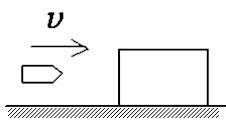

（C）子弹动能的减少等于子弹克服木块阻力所作的功；（D）子弹克服木块阻力所作的功等于这一过程中产生的热

7． 一质量为m 的滑块，由静止开始沿着 1/4 圆弧形光滑的木槽滑下。设木槽的质量也是m。槽的圆半径为R，放在光滑水平地面上，如图所示。则滑块离开槽时的速度是（ ）（A） $\sqrt { 2 R g }$ ； （B） $2 \sqrt { R g }$ ； （C） $\sqrt { R g }$ ： （D） $\frac { 1 } { 2 } \sqrt { R g }$

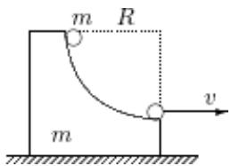

8． 一均匀细杆原来静止放在光滑的水平面上，现在其一端给予一垂直于杆身的水平方向的打击，此后杆的运动情况是：（ ）（A）杆沿力的方向平动；（B）杆绕其未受打击的端点转动；（C）杆的质心沿打击力的方向运动，杆又绕质心转动；（D）杆的质心不动，而杆绕质心转动。

9． 如图所示，一个小物体，位于光滑的水平桌面上，与一绳的一端相连结，绳的另一端穿过桌面中心的小孔O. 该物体原以角速度ω在半径为R的圆周上绕O旋转，今将绳从小孔缓慢往下拉．则物体（ ）（A）动能不变，动量改变; （B）动量不变，动能改变;（C）角动量不变，动量不变; （D）角动量改变，动量改变;（E）角动量不变，动能、动量都改变

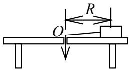

10．人造地球卫星，绕地球作椭圆轨道运动，地球在椭圆的一个焦点上，则卫星的（ ）（A） 动量不守恒，动能守恒；（B）动量守恒，动能不守恒；（C）对地心的角动量守恒，动能不守恒；（D）对地心的角动量不守恒，动能守恒。

11．一圆盘绕过盘心且与盘面垂直的光滑固定轴O以角速度ω按图示方向转动.若如图所示的情况那样，将两个大小相等方向相反但不在同一条直线的力F沿盘面同时作用到圆盘上，则圆盘的角速度（ ）（A）必然增大; （B）必然减少;（C）不会改变; （D）如何变化，不能确定

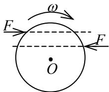

12．均匀细棒OA可绕通过其一端O而与棒垂直的水平固定光滑轴转动，如图所示．今使棒从水平位置由静止开始自由下落，在棒摆动到竖直位置的过程中，下述说法哪一种是正确的？（ ）（A） 角速度从小到大，角加速度从大到小;（B） 角速度从小到大，角加速度从小到大;（C） 角速度从大到小，角加速度从大到小;（D） 角速度从大到小，角加速度从小到大

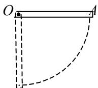

13．图（a）为一绳长为l 、质量为m 的单摆。图（b）为一长度为l、质量m为能绕水平固定轴O自由转动的匀质细棒。现将单摆和细棒同时从与竖直线成θ 角度的位置由静止释放。若运动到竖直位置时，单摆、细棒角速度分别以 $\omega _ { 1 } , \ \omega _ { 2 }$ 表示。则：（ ）（A） $\omega _ { 1 } { = } 2 \omega _ { 2 }$ ； （B） $\omega _ { 1 } { = } \omega _ { 2 }$ ；（C） $\omega _ { 1 } = \frac { 2 } { 3 } \omega _ { 2 }$ ； (D) ${ \omega } _ { 1 } = \sqrt { \frac { 2 } { 3 } } { \omega } _ { 2 }$ 。

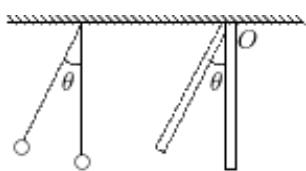  
(b)

14．一轻绳跨过一具有水平光滑轴、质量为 的定滑轮，绳的两端分别悬有质量为 $m _ { 1 }$ 和 $m _ { 2 }$ 的物体 $( m _ { 1 } < m _ { 2 } )$ ，如图所示。绳与轮之间无相对滑动。若某时刻滑轮沿逆时针方向转动，则绳中的张力（ ）（A）处处相等； （B）左边大于右边；（C）右边大于左边； （D）哪边大无法判断。

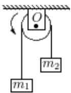

15．一自由悬挂的匀质细棒 AB，可绕 A 端在竖直平面内自由转动，现给 B 端一初速$\mathbf { V } _ { 0 } ,$ ，则棒在向上转动过程中仅就大小而言（ ）（A）角速度不断减小，角加速度不断减少；（B）角速度不断减小，角加速度不断增加；（C）角速度不断减小，角加速度不变；（D）所受力矩越来越大，角速度也越来越大。

16．一长为l，质量为m 的匀质细棒，绕一端作匀速转动，其中心处的速率为v，则细棒的转动动能为（ ）（A） $\mathrm { m } \mathrm { v } ^ { 2 } / 2$ （B） $2 \mathrm { m v } ^ { 2 } / 3$ （C） $\mathrm { m } \mathrm { v } ^ { 2 } / 6$ （D） $\mathrm { m v } ^ { 2 } / 2 4$

17．光滑的水平桌面上，有一长为 2L、质量为m的匀质细杆，可绕过其中点且垂直于杆的竖直光滑固定轴O自由转动，其转动惯量为 ${ \frac { 1 } { 3 } } m L ^ { 2 }$ ，起初杆静止．桌面上有两个质量均为m的小球，各自在垂直于杆的方向上，正对着杆的一端，以相同速率v相向运动，如图所示．当两小球同时与杆的两个端点发生完全非弹性碰撞后，就与杆粘在一起转动，则这一系统碰撞后的转动角速度应为（ ）（A） $\frac { 2 \nu } { 3 L }$ ； （B） $\frac { 4 \upsilon } { 5 L }$ ； （C） $\frac { 6 \nu } { 7 L }$ ； （D） $\frac { 8 \nu } { 9 L }$

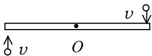  
俯视图

## 二、填空题

18．质点的运动方程 $\vec { r } = \left( t - \frac { t ^ { 2 } } { 2 } \right) \vec { i } + \left( 5 - 3 t + \frac { t ^ { 3 } } { 3 } \right) \vec { j }$ （ S I ）, 当 $\mathrm { \ t { = } } 2 \mathrm { { s } }$ 时，其加速度 $\vec { a } =$

19．在如图所示的装置中，两个定滑轮与绳的质量以及滑轮与其轴之间的摩擦都可忽略不计，绳子不可伸长， $m _ { 1 }$ 与平面之间的摩擦也可不计，在水平外力 F 的作用下，物体 $m _ { 1 }$ 与 $m _ { 2 }$ 的加速度 a＝ _，绳中的张力 T＝

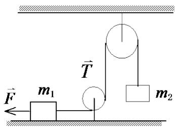

20．质量为 m 子弹以速度 $\nu _ { 0 }$ 水平射入沙土中，设子弹所受阻力与速度成正比，比例系数为 k，忽略子弹的重力，求：（1）子弹射入沙土后,速度随时间变化的函数关系式 _；（2）子弹射入沙土的最大深度 。

21．一颗子弹在枪筒里前进时所受的合力大小为 $F = 4 0 0 - { \frac { 4 \times 1 0 ^ { 5 } } { 3 } } t$ （SI） ，子弹从枪口射出时的速率为 300 m/s。假设子弹离开枪口时合力刚好为零，则 （1）子弹走完枪筒全长所用的时间t = _； （2）子弹在枪筒中所受力的冲量I =； （3）子弹的质量m= 。

22．在半径为R的圆周上运动的质点，其速率与时间关系为 $\scriptstyle \nu = c t ^ { 2 }$ （式中c为常量），则从t=0到t时刻质点走过的路程S（t） _； 时刻质点的切向加速度$a _ { t } { = }$ ； 时刻质点的法向加速度 $a _ { n } =$ 。

23．一质量为m的小球A，在距离地面某一高度处以速度v 水平抛出，触地后反跳．在抛出t秒后小球A跳回原高度，速度仍沿水平方向，速度大小也与抛出时相同，如图．则小球A与地面碰撞过程中，地面给它的冲量的方向为 _，冲量的大小为_

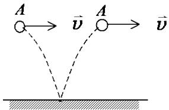

24．如图所示，一质量为 $m = 2 \mathrm { k g }$ 、半径为 $R = 2 \mathrm { m }$ 的薄圆盘，可绕通过其一直径的光滑固定轴 $A A "$ 转动，转动惯量 $J = m R ^ { 2 } { \big / } 4$ 。该圆盘从静止开始在恒力矩$M = 1 0 0 \mathrm { N \cdot m }$ 作用下转动，则 $t = 3 \mathrm { ~ s ~ }$ 秒后位于圆盘边缘上与轴 AA'的垂直距离为 R的B点的切向加速度的大小 $a _ { t } =$ $\mathrm { m } / \mathrm { s } ^ { 2 }$ 。 （两位有效数字）

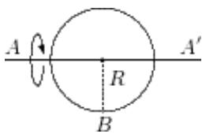

25．如图，质量为m长为 $l = 0 . 2 \mathrm { m }$ 的均匀细杆，放在倾角为 $\alpha { = } 3 0 ^ { 0 }$ 光滑斜面上，可以绕通过杆上端且与斜面垂直的光滑轴O在斜面上转动。要使此杆能绕轴转动一周，则杆的最小初始角速度 $\omega _ { 0 } =$ _rad/s。（重力加速度为 $9 . 8 \mathrm { m } / \mathrm { s } ^ { 2 }$ ，结果保留两位有效数字）

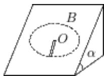

26．在光滑的水平面上，一根长 L＝2 m 的绳子，一端固定于 O 点，另一端系一质量 m＝0.5 kg的物体．开始时，物体位于位置 A，OA间距离 $d { = } 0 . 5 \mathrm { m }$ ，绳子处于松弛状态．现在使物体以初速度 $\nu _ { A } { = } 4 \mathrm { m } { \cdot } \mathrm { s } ^ { - 1 }$ 垂直于 OA 向右滑动，如图所示．设以后的运动中物体到达位置B,此时物体速度的方向与绳垂直．则此时刻物体对O点的角动量的大小 $L _ { B } =$ ，物体速度的大小 v＝

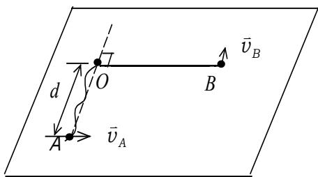

27．用一根长度为 $L = 3 . 2$ 米的细线悬挂一质量为m的小球，线所能承受的最大张力为$T = 1 . 5 m g$ 。现在把线拉至水平位置然后由静止放开，若线断后小球的落地点C恰好在悬点 O 的正下方，如图所示。 则高度OC = （两位有效数字）

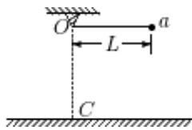

28．如图所示，在地面上固定一半径为 $R = 0 . 5 \mathrm { ~ m ~ }$ 的光滑球面，球面顶点A处放一质量为 $7 . 0 \mathrm { k g }$ 的滑块。一质量为 $m = 0 . 2 { \mathrm { ~ k g } }$ 的油灰球，以水平速度 $\nu _ { \mathrm { { 0 } } } = 1 0 . 5 \mathrm { { m / s } }$ 射向滑块，并粘附在滑块上一起沿球面下滑。则他们脱离球面时所成的角度 $\theta =$ rad，（重力加速度 $g = 9 . 8 \mathrm { m } / \mathrm { s } ^ { 2 }$ ，结果保留两位有效数字）

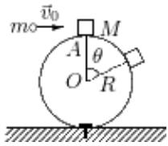

29．一长为 $l ,$ 、质量可以忽略的直杆，两端分别固定有质量为 $2 m$ 和m的小球，杆可绕通过其中 $\iota \dot { \iota } \textit { O }$ 且与杆垂直的水平光滑固定轴在铅直平面内转动．开始杆与水平方向成某一角度 $\theta$ ，处于静止状态，如图所示．释放后，杆绕O轴转动．则当杆转到水平位置时，该系统所受到的合外力矩的大小 $M =$ _，此时该系统角加速度的大小 $\beta =$

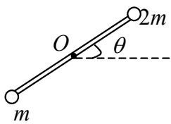

30．长为l的杆如图悬挂．O为水平光滑固定转轴，平衡时杆竖直下垂，一子弹水平地射入杆中．则在此过程中， 系统对转轴O 的 _守恒．

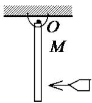

31．一水平的匀质圆盘，可绕通过盘心的竖直光滑固定轴自由转动．圆盘质量为M，半径为R，对轴的转动惯量 $J { = } \frac { 1 } { 2 } M R ^ { 2 }$ ．当圆盘以角速度 $\omega _ { 0 }$ 转动时，有一质量为m的子弹沿盘的直径方向射入而嵌在盘的边缘上．子弹射入后，圆盘的角速度 $\omega =$ ·

32．一长为l质量可以忽略的直杆，可绕通过其一端的水平光滑轴在竖直平面内作定轴转动，在杆的另一端固定着一质量为m的小球，如图所示．现将杆由水平位置无初转速地释放．则杆刚被释放时的角加速度 $\beta _ { 0 }$ = _，杆与水平方向夹角为 $6 0 ^ { \circ }$ 时的角加速度 $\beta =$

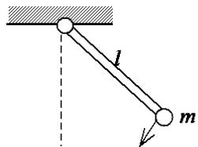

## 三、计算题

33．如图，用传送带A输送煤粉，料斗口在A上方高 $h = 0 . 5 \mathrm { m }$ 处，煤粉自料斗口自由落在A上．设料斗口连续卸煤的流量为 $q _ { m } = 4 0$ kg/s ，A 以 $\nu { = } 2 . 0 \mathrm { m / s }$ 的水平速度匀速向右移动．求装煤的过程中，煤粉对A的作用力的大小和方向．（不计相对传送带静止的煤粉质重）

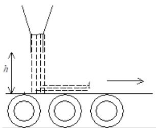

34．一升降机内有一倾角为α的固定光滑斜面，如图所示。当升降机以匀加速度 $\vec { a } _ { 0 }$ 上升时，质量为m的物体A沿斜面滑下，试以升降机为参考系，求A对地面的加速度 a  .

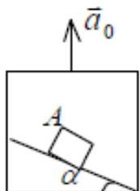

35．一根特殊弹簧，在伸长 x 米时，其弹力为 $4 x + 6 x ^ { 2 }$ 牛顿。

（1）试求把弹簧从 x=0.5m 米拉长到 $x { = } 1 . 0 \mathrm { m }$ 米时，外力克服弹簧力所作的总功。

（2）将弹簧的一端固定，在其另一端拴一质量为2千克的静止物体，试求弹簧从$x { = } 1 . 0$ 米回到x=0.5米时物体的速率。（不计重力）

36．两个滑冰运动员A、B的质量均为 $m { = } 7 0 \mathrm { k g }$ ，以 $\nu _ { 0 } = 6 . 5 \mathrm { m } / \mathrm { s }$ 的速率沿相反方向滑行，滑行路线间的垂直距离为 $R = 1 0 \mathrm { m }$ ，当彼此交错时，各抓住10 m绳索的一端，然后相对旋转,

（1） 在抓住绳索之前，各自对绳中心的角动量是多少？抓住后又是多少？

（2）他们各自收拢绳索，到绳长为r =5 m时，各自的速率如何？

（3）绳长为5 m时，绳内的张力多大？

（4）二人在收拢绳索时，设收绳速率相同，问二人各做了多少功？

37．一条轻绳跨过一轻滑轮（滑轮与轴间摩擦可忽略），在绳的一端挂一质量为 $m _ { \mathrm { l } }$ 的物体，在另一侧有一质量为 $m _ { 2 }$ 的环，求当环相对于绳以恒定的加速度 $a _ { 2 }$ 沿绳向下滑动时，物体和环相对地面的加速度各是多少？环与绳间的摩擦力多大？

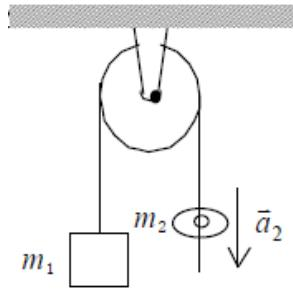

38．质量分别为m和2m 、半径分别为r 和2r 的两个均匀圆盘，同轴地粘在一起，可以绕通过盘心且垂直盘面的水平光滑固定轴转动，对转轴的转动惯量为 $9 m r ^ { 2 } / 2$ ，大小圆盘边缘都绕有绳子，绳子下端都挂一质量为m的重物，如图所示．求盘的角加速度的大小．

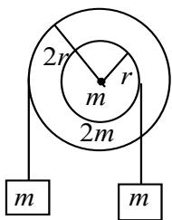

39．一质量为M ，长为l的均匀细直杆，可绕通过其中心 且与杆垂直的光滑水平固定轴，在竖直平面内转动。当杆停止于竖直位置时，质量为m的子弹沿水平方向射入杆的下端且留在杆内，并使杆摆动，若杆摆动的最大偏角为θ，试求：（1）入射前的速率 $\upsilon _ { 0 }$ ；（2）在最大偏角θ时，杆转动的角加速度。

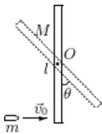

40．一质量均匀分布的圆盘，质量为M ，半径为R，放在一粗糙水平面上（圆盘与水平面之间的摩擦系数为 $\mu$ ），圆盘可绕通过其中心O的竖直固定光滑轴转动．开始时，圆盘静止，一质量为m的子弹以水平速度 $\upsilon _ { 0 }$ 垂直于圆盘半径打入圆盘边缘并嵌在盘边上，求（1）子弹击中圆盘后，盘所获得的角速度；（2）经过多少时间后，圆盘停止转动（圆盘绕通过O的竖直轴的转动惯量为 $\frac { 1 } { 2 } M R ^ { 2 }$ ，忽略子弹重力造成的摩擦阻力矩）。

41．一车轮可绕通过轮心O且与轮面垂直的水平光滑固定轴，在竖直面内转动，轮的质量为M，可以认为均匀分布在半径为R的圆周上，绕O轴的转动惯量J＝$M R ^ { 2 }$ ．车轮原来静止，一质量为 m 的子弹，以速度 $\upsilon _ { 0 }$ 沿与水平方向成α 角度射中轮心O正上方的轮缘A处，并留在A处，如图所示．设子弹与轮撞击时间极短．问：

（1）以车轮、子弹为研究系统，撞击前后系统的动量是否守恒？为什么？动能是否守恒？为什么？角动量是否守恒？为什么？

（2）子弹和轮开始一起运动时，轮的角速度是多少？

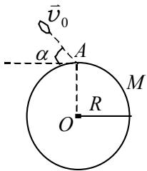

42．一长为 1 m 的均匀直棒可绕过其一端且与棒垂直的水平光滑固定轴转动．抬起另一端使棒向上与水平面成 $6 0 ^ { \circ }$ ，然后无初转速地将棒释放．已知棒对轴的转动惯量为 ${ \frac { 1 } { 3 } } m l ^ { 2 }$ ，其中 m 和 l 分别为棒的质量和长度．求：

（1）放手时棒的角加速度；

（2）棒转到水平位置时的角加速度

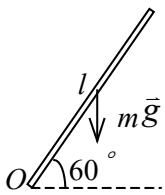

43．两个大小不同、具有水平光滑轴的定滑轮，顶点在同一水平线上。小滑轮的质量为 m，半径为 r，对轴的转动惯量 $J = { \frac { 1 } { 2 } } m r ^ { 2 }$ 。大滑轮的质量 $m { ' } { = } 2 m$ ，半径 $r ^ { \prime } { = } 2 r$ ，对轴的转动惯量 $J ^ { \prime } { = } \frac { 1 } { 2 } m ^ { \prime } { r ^ { \prime } } ^ { 2 }$ 。一根不可伸长的轻质细绳跨过这两个定滑轮，绳的两端分别挂着物体 A和 B。A的质量为 m，B的质量 $m { ' } { = } 2 m$ 。这一系统由静止开始转动。已知 $m { = } 6 . 0 \mathrm { k g }$ ， $r { = } 5 . 0 \mathrm { c m }$ 。求两滑轮的角加速度和它们之间绳中的张力。

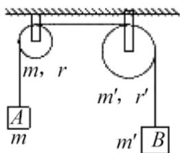