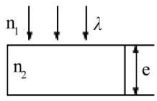
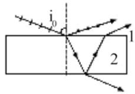
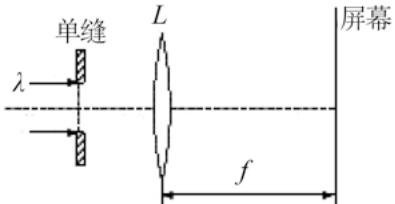
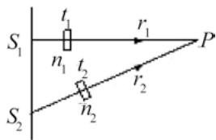
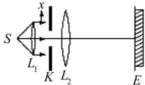
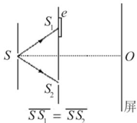
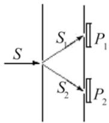
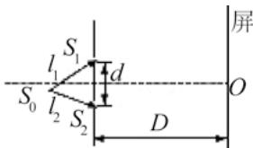
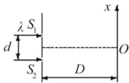

# 波动光学综合测试

## 一、选择题

1．（xz1000A000009225）如图所示，波长为λ 的平行单色光垂直入射在折射率为 n2的薄膜上，经上下两个表面反射的两束光发生干涉。若薄膜厚度为 e，而且 $n _ { 1 } > n _ { 2 } >$ $n _ { 3 }$ ，则两束反射光在相遇点的相位差为 （ ）

（A） $4 \pi n _ { 2 } e / \lambda$ （B） $2 \pi n _ { 2 } e / \lambda$ （C） $( 4 \pi n _ { 2 } e / \lambda ) + \pi$ （D） $\left( 2 \pi n _ { 2 } e / \lambda \right) - \pi$

2． （xz1000A000009109）在双缝干涉实验中，设缝是水平的。若双缝所在的平板稍微向上平移，其它条件不变，则屏上的干涉条纹 （ ）（A）向下平移，且间距不变；（B）向上平移，且间距不变；（C）不移动，但间距改变；（D）向上平移，且间距改变。

3．（xz1000A000008998）把一平凸透镜放在平玻璃上，构成牛顿环装置。当平凸透镜慢慢地向上平移时，由反射光形成的牛顿环 （ ）（A）向中心收缩，条纹间隔变小；（B）向中心收缩，环心呈明暗交替变化（C）向外扩张，环心呈明暗交替变化；（D）向外扩张，条纹间隔变大。

4．（xz0000A000008983）自然光以 $6 0 ^ { \circ }$ 的入射角照射到某两介质交界面时，反射光为完全线偏振光，则知折射光为 （ ）（A）完全线偏振光且折射角是 $3 0 ^ { \circ }$ ；（B）部分偏振光且只是在该光由真空入射到折射率为 $\sqrt { 3 }$ 的介质时，折射角是 $3 0 ^ { \circ }$ ；（C）部分偏振光，但须知两种介质的折射率才能确定折射角；（D）部分偏振光且折射角是 $3 0 ^ { \circ }$ 。

5．（xz0000A000009309）一束自然光自空气射向一块平板玻璃（如图），设入射角等于布儒斯特角 $i _ { 0 } \}$ ，则在界面2的反射光 （ ）

（A）是自然光；

（B）是线偏振光且光矢量的振动方向垂直于入射面；

（C）是线偏辰光且光矢量的振动方向平行于入射面；  
（D）是部分偏振光。

6．（xz0000A000009307）在如图所示的单缝夫琅禾费衍射实验中，若将单缝沿透镜光轴方向向透镜平移，则屏幕上的衍射条纹 （ ）

（A）间距变大；

（B）间距变小；

（C）不发生变化；

（D）间距不变，但明暗条纹的位置交替变化。

7．（xz0000A000008999）两块平玻璃构成空气劈形膜，左边为棱边，用单色平行光垂直入射。若上面的平玻璃以棱边为轴，沿逆时针方向作微小转动，则干涉条纹的（ ）（A）间隔变小，并向棱边方向平移；（B）间隔变大，并向远离棱边方向平移；（C）间隔不变，向棱边方向平移；（D）间隔变小，并向远离棱边方向平移。

8．（xz1000A000009430）如图， $S _ { 1 }$ 、 $S _ { 2 }$ 是两个相干光源，它们到 P 点的距离分别为 $r _ { 1 }$ 和 $r _ { 2 } .$ 。路径 $S _ { 1 } P$ 垂直穿过一块厚度为 $t _ { 1 }$ ，折射率为 $n _ { 1 }$ 的介质板，路径 $S _ { 2 } P$ 垂直穿过厚度为 $t _ { 2 }$ ，折射率为 $n _ { 2 }$ 的另一介质板，其余部分可看作真空，这两条路径的光程差等于（ ）[1mm]

（A） $\left( r _ { 2 } + n _ { 2 } t _ { 2 } \right) - \left( r _ { 1 } + n _ { 1 } t _ { 1 } \right)$ （B） $\left( r _ { 2 } + \left( n _ { 2 } - 1 \right) t _ { 2 } \right) - \left( r _ { 1 } + \left( n _ { 1 } - 1 \right) t _ { 2 } \right)$ （C） $\left( r _ { 2 } - n _ { 2 } t _ { 2 } \right) - \left( r _ { 1 } - n _ { 1 } t _ { 1 } \right)$ （D） $n _ { 2 } t _ { 2 } - n _ { 1 } t _ { 1 }$

9．（xz1000A000009000）波长为λ的单色光垂直入射于光栅常数为 d、缝宽为 a、总缝数为 N 的光栅上。取 k=0，±1，±2…，则决定出现主极大的衍射角 θ 的公式可写成 （ ）（A） $N a \sin \theta { = } k \lambda$ （B） $a \mathrm { s i n } \theta { = } k \lambda$ （C） $N d \mathrm { s i n } \theta { = } k \lambda$ （D） $d \mathrm { s i n } \theta = k \lambda$

10．（xz0000A000009308）两偏振片堆叠在一起，一束自然光垂直入射其上时没有光线通过。当其中一偏振片慢慢转动 $1 8 0 ^ { \circ }$ 时透射光强度发生的变化为：（ ）（A）光强单调增加；（B）光强先增加，然后减小，再增加，再减小至零。

（C）光强先增加，后减小，再增加；

（D）光强先增加，后又减小至零；

11．（xz1000A000009406）在如图所示的单缝的夫琅禾费衍射实验中，将单缝 K 沿垂直于光的入射方向（沿图中的x方向）稍微平移，则 （ ）

（A）衍射条纹移动，条纹宽度不变；  
（B）衍射条纹移动，条纹宽度变动；  
（C）衍射条纹中心不动，条纹变宽；  
（D）衍射条纹不动，条纹宽度不变；

12 ． （ xz1000A000009402 ） 波 长 $\lambda = 5 0 0 \mathrm { n m } \big ( \mathrm { l n m } = 1 0 ^ { - 9 } \mathrm { m } \big )$ 的 单 色 垂 直 照 射 到 宽 度a=0.25mm 的单缝上，单缝后面放置一凸透镜，在凸透镜的焦平面上放置一屏幕，用以观测衍射条纹。今测得屏幕上中央明条纹一侧第三个暗条纹和另一侧第三个暗条纹之间的距离为 d=12mm，则凸透镜的焦距 f 为 （ ）（A）2m （B）1m（C）0.5m （D）0.2m

13．（xz1000A000009001）测量单色光的波长时，下列方法中哪一种方法最为准确？（ ）（A）双缝干涉； （B）牛顿环；（C）单缝衍射； （D）光栅衍射。

14．（xz1000A000008960）在双缝干涉实验中，两条缝的宽度原来是相等的。若其中一缝的宽度略变窄（缝中心位置不变），则 （ ）（A）干涉条纹的间距变宽；（B）干涉条纹的间距变窄；（C）干涉条纹的间距不变，但原极小处的强度不再为零；（D）不再发生干涉现象。

## 二、填空题

15．（tk1000A000009100）空气中一玻璃劈形膜其一端厚度为零另一端厚度为0.005cm，折射率为 1.5。现用波长为 $6 0 0 \mathrm { n m } \left( 1 \mathrm { n m } = 1 0 ^ { - 9 } \mathrm { m } \right)$ 的单色平行光，沿入射角为 $3 0 ^ { \circ }$ 角的方向射到劈的上表面，则在劈形膜上形成的干涉条纹数目为

16．（tk0000A000009221）如图，在双缝干涉实验中，若把一厚度为 e、折射率为 n的薄云母片覆盖在 $S _ { 1 }$ 缝上，中央明条纹将向 移动；覆盖云母片后，两束相干光至原中央明纹O处的光程差为 。

17．（tk1000A000009038）平行单色光垂直入射在缝宽为 $a { = } 0 . 1 5 \mathrm { m m }$ 的单缝上。缝后有焦距为 $f { = } 4 0 0 \mathrm { m m }$ 的凸透镜，在其 焦平面上放置观察屏幕。现测得屏幕上中央明条纹两侧的两个第三级暗纹之间的距离为 8mm，则入射光的波长为=

18．（tk1000A000009434）如图所示的杨氏双缝干涉装置，若用单色自然光照射狭缝S，在屏幕上能看到干涉条纹。若在双缝 $S _ { 1 }$ 和 $S _ { 2 }$ 的一侧分别加一同质同厚的偏振片 $P _ { 1 } , \ P _ { 2 }$ ，则当 $P _ { 1 }$ 与 $P _ { 1 }$ 的偏振化方向相互 时，在屏幕上仍能看到很清晰的干涉条纹。

19．（tk1000A000009043）一束平行的自然光，以 $6 0 ^ { \circ }$ 角入射到平玻璃表面上．若反射光束是完全偏振的，则透射光束的折射角是 ； 玻璃的折射率为。

20．（tk1000A000009416）若对应于衍射角 $\varphi = 3 0 ^ { \circ }$ ，单缝处的波面可划分为 4 个半波带，则单缝的宽度a= λ（λ为入射光波长）。

21．（tk1000A000009417）一束单色光垂直入射在光栅上，衍射光谱中共出现 5 条明纹。若已知此光栅缝宽度与不透明部分宽度相等，那么在中央明纹一侧的两条明纹分别是 级和第 级谱线。

22．（tk1000A000009036）He－Ne 激光器发出 $\lambda { = } 6 3 2 . 8 \mathrm { n m } \left( \mathrm { l n m } = 1 0 ^ { - 9 } \mathrm { m } \right)$ 的平行光束，垂直照射到一单缝上，在距单缝 3m远的屏上观察夫琅禾费衍射图样，测得两个第二级暗纹间的距离是10cm，则单缝的宽度 $a { = }$ 。

23．（tk1000A000009037）在单缝夫琅禾费衍射实验中，设第一级暗纹的衍射角很小，若钠黄光 $( \left( \lambda _ { 1 } \approx 5 8 9 \mathrm { m m } \right)$ 中央明纹宽度为 4.0mm，则 $\lambda _ { \scriptscriptstyle 2 } = 4 4 2 \mathrm { n m } \big ( 1 \mathrm { n m } = 1 0 ^ { - 9 } \mathrm { m } \big )$ 的蓝紫色光的中央明纹宽度为 。

24．（tk1000A000009435）可见光的波长范围是 400nm─760nm。用平行的白光垂直入射在平面透射光栅上时，它产生的不与另一级光谱重叠的完整的可见光光谱是第级光谱。 $\left( 1 \mathrm { n m } = 1 0 ^ { - 9 } \mathrm { m } \right)$

## 三、计算题

25．（js1000A000009065）在牛顿环装置的平凸透镜和平玻璃板之间充满折射率n=1.33 的透明液体（设平凸透镜和平板玻璃的折射率都大于 1.33）。凸透镜的曲率半径为300cm， 波长 $\lambda = 6 5 0 \mathrm { n m } \big ( \mathrm { l n m } = 1 0 ^ { - 9 } \mathrm { m } \big )$ 的平行单色垂直照射到牛顿环装置上，凸透镜顶部刚好与平玻璃板接触，求：

（1）从中心向外数第十个明环所在处的液体厚度；

（2）第十个明环的半径 $r _ { 1 0 }$ 。

26．（js1000A000009079）一束自然光自水中入射到空气界面上，若水的折射率为1.33，空气的折射率为1.00，求布儒斯特角。

27．（js1000A000009101）由强度为 $I _ { a }$ 的自然光和强度为 $I _ { b }$ 的线偏振光混合而成的一束入射光，垂直入射在一偏振片上，当以入射光方向为转轴旋转偏振片时，出射光将出现最大值和最小值。其比值为 n。 试求出 $I _ { a } / I _ { b }$ 与n的关系。

28．（js1000A000009067）波长范围在 450\~650nm 之间的复色平行光垂直照射在每厘米有 5000 条刻线的光栅上，屏幕放在透镜的焦面处，屏上第二级光谱各色光在屏上所占范围的宽度为 35.1cm。求透镜的焦距 $f _ { \circ }$ （ $\mathrm { \Omega _ { 1 n m = 1 0 } - } ^ { 9 } \mathrm { m } \mathrm { ) }$ ）

29．（js1000A000009068）一束平行光垂直入射到某个光栅上，该光束有两种波长的光， $\lambda _ { 1 } = 4 4 0 \mathrm { n m }$ ， $\lambda _ { \scriptscriptstyle 2 } = 6 6 0 \mathrm { n m } \big ( 1 \mathrm { n m } = 1 0 ^ { - 9 } \mathrm { m } \big )$ 。实验发现，两种波长的谱线（不计中央明纹）第二次重合于衍射角 $\varphi = 6 0 ^ { \circ }$ 的方向上。求此光栅的光栅常数 $d _ { \circ }$ 。

30．（js1000A000009312）氦放电管发出的光垂直照射到某光栅上，测得波长$\lambda _ { 1 } = 0 . 6 6 8 \mu m$ 的谱线的衍射角为 $\varphi = 2 0 ^ { \circ }$ 。如果在同样 $\varphi$ 角处出现波长 $\lambda _ { 2 } = 0 . 4 4 7 \mu m$ 的更高级次的谱线，那么光栅常数最小是多少？

31．（js1000A000009046）在双缝干涉实验中，单色光源 $S _ { 0 }$ 到两缝 $S _ { 1 }$ 和 $S _ { 2 }$ 的距离分别为 $l _ { 1 }$ 和 $l _ { 2 }$ ，并且 $l _ { 1 } - l _ { 1 } = 3 \lambda$ ，λ为入射光的波长，双缝之间的距离为 $d ,$ ，双缝到屏幕的距离为 $\mathrm { ~ D ~ } \left( \mathrm { D } \mathord { \left/ { \vphantom { \mathrm { D } } } \right. \kern - delimiterspace } \mathrm { > } \mathord { \left/ { \vphantom { \mathrm { D } } } \right. \kern - delimiterspace } \right)$ ，如图。求：

（1）零级明纹到屏幕中央 $O$ 点的距离。

（2）相邻明条纹间的距离。

32．（js1000A000009055）双缝干涉实验装置如图所示，双缝与屏之间的距离 $D { = } 1 2 0 \mathrm { c m }$ ，两缝之间的距离 d=0.50mm，用波长 $\lambda = 5 0 0 \mathrm { n m } \big ( \mathrm { l n m } = 1 0 ^ { - 9 } \mathrm { m } \big )$ 的单色光 垂直照射双缝。

（1）求原点 $O$ （零级明条纹所在处）上方的第五级明条纹的坐标 x；

（2）如果用厚度 $l { = } 1 . 0 { \times } 1 0 ^ { - 2 } \mathrm { m m }$ ，折射率 $n { = } 1 . 5 8$ 的透明薄膜复盖在图中的 $S _ { 1 }$ 缝后面，求上述第五级明条纹的坐标 $x ^ { \prime } ,$ 。

33．（js1000A000009049）折射率为 1.60 的两块标准平面玻璃板之间形成一个劈形膜（劈尖角 θ 很小）。用波长 $\lambda = 6 0 0 \mathrm { n m } \big ( \mathrm { l n m } = 1 0 ^ { - 9 } \mathrm { m } \big )$ 的单色光垂直入射，产生等厚干涉条纹。假如在劈形膜内充满 n=1.40 的液体时的相邻明纹间距比劈形膜内空气时的间距缩小 $\Delta l = 0 . 5 \mathrm { m m }$ ，那么劈尖角θ应是多少？